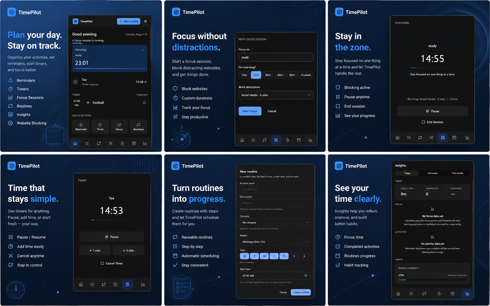
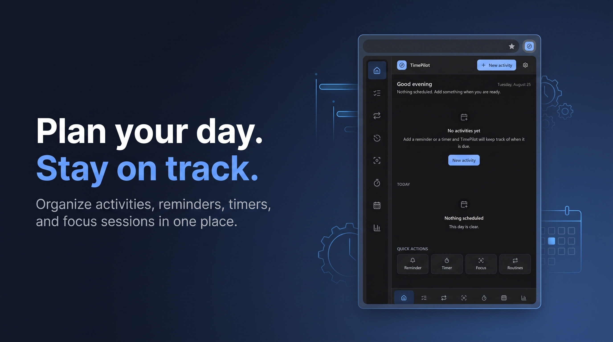
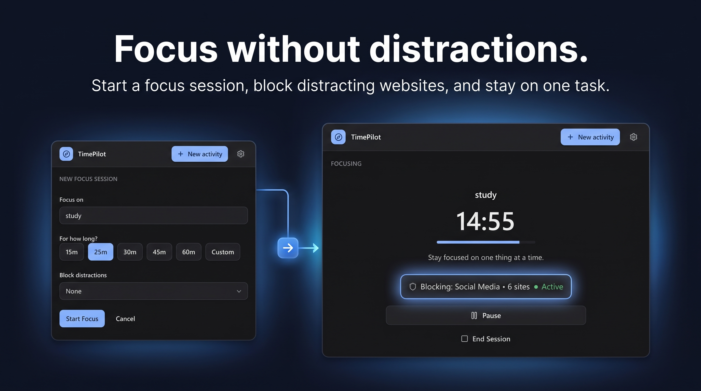
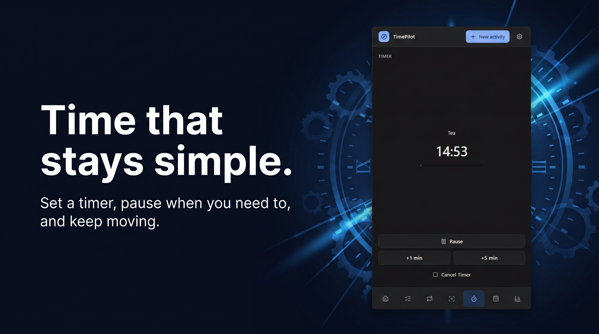
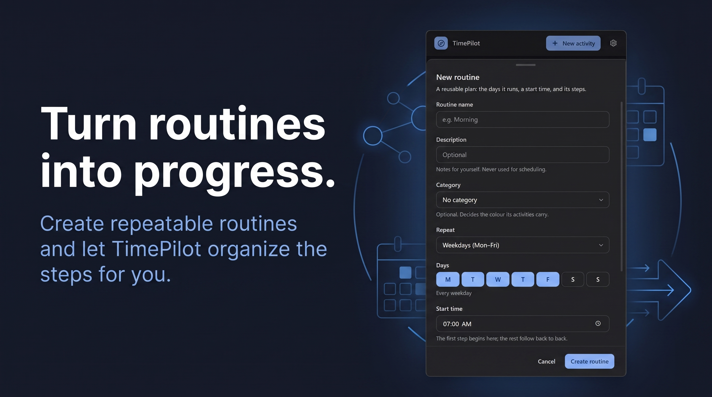
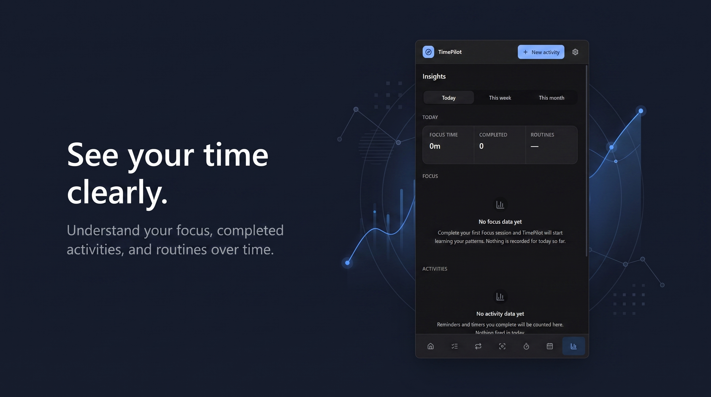

# TimePilot

**A local-first personal time and activity assistant — built as a Chromium browser extension.**

TimePilot is a privacy-first productivity tool that runs entirely inside your browser. It combines scheduled activities, focus sessions with website blocking, countdown timers, reusable day-plan routines, and personal insights — all without accounts, cloud services, or network requests of any kind.

Built with React 19, TypeScript 6, Tailwind CSS 4, and Vite 8 on the Chrome Extensions Manifest V3 platform.

---

## Product Showcase



*Side panel overview — the primary surface, with Home and the nine-page navigation.*

| | |
|---|---|
|  |  |
| *Planning — scheduled activities across day and week views.* | *Focus — a countdown session with its optional website blocklist.* |
|  |  |
| *Timer — the standalone countdown, sharing the same countdown infrastructure.* | *Routines — reusable multi-step day plans that generate scheduled activities.* |



*Insights — focus totals, session counts, and per-day breakdowns, computed locally.*

---

## Key Features

| Feature | Description |
|---|---|
| **Activities** | One-off and repeating scheduled items with categories, durations, and per-item notification settings |
| **Reminders** | `chrome.alarms`-backed scheduler with *Done* and *Snooze* notification actions, plus automatic alarm reconciliation after restarts, time-zone changes, and DST transitions |
| **Focus Sessions** | Countdown timer with pause, resume, add-time, and cancel — with an optional website blocklist enforced for the session duration |
| **Countdown Timer** | Standalone timer sharing the same countdown infrastructure |
| **Routines** | Reusable multi-step day plans that generate scheduled activities; editing or disabling a routine reconciles the rows it owns |
| **Schedule** | Day and week views across all scheduled items |
| **Website Blocking** | `declarativeNetRequest` blocklists in two modes: *focus-only* (active during a session) and *always-on*. Blocked navigations redirect to the extension's own landing page |
| **Insights** | Focus totals, session counts, averages, and per-day breakdowns for today, this week, or this month — computed locally from stored session data |
| **Onboarding** | Six-step guided tour on first run, reopenable from Settings |
| **Popup** | Toolbar popup showing the next scheduled item and quick actions |
| **Theming** | Light, dark, and system-follow themes, all verified for WCAG AA contrast |

## Product Surfaces

TimePilot presents three extension surfaces:

- **Side Panel** — the primary UI with nine pages: Home, Activities, Schedule, Focus, Timer, Routines, Insights, Settings, and Onboarding
- **Popup** — a compact toolbar popup for at-a-glance status and quick actions
- **Blocked Page** — a branded landing page shown when a blocked navigation is intercepted

## Technology Stack

| Layer | Technology |
|---|---|
| Language | TypeScript 6 |
| UI Framework | React 19 |
| Styling | Tailwind CSS 4 |
| Build Tool | Vite 8 |
| Extension Platform | Chrome Manifest V3 (`minimum_chrome_version: 116`) |
| Unit Testing | Vitest 4 |
| Linting | ESLint 10 |
| Integration Testing | Custom CDP (Chrome DevTools Protocol) harness |
| Icons | Lucide React |

## Architecture Overview

```
public/manifest.json          MV3 manifest
public/icons/                 Generated PNG icons (16/32/48/128)

src/
├── surfaces/                 Three extension entry points
│   ├── sidepanel/            Side panel UI and its nine pages
│   ├── popup/                Toolbar popup UI
│   └── blocked/              Blocked-page UI
├── components/               Design-system and feature components
├── theme/                    Light / dark / system theme provider
├── hooks/                    React hooks over the worker and storage
├── background/               MV3 service worker
│   ├── service-worker.ts     Entry: listener registration only
│   ├── router.ts             Request → feature dispatch (37 message types)
│   └── features/             Scheduler, focus, timers, routines, blocking
├── services/                 Chrome API wrappers (storage, alarms,
│                             notifications, messaging, blocking, side panel)
├── models/                   Domain types — no Chrome dependencies
└── lib/                      Pure logic (insights, rule planning, serial
                              queue, time utilities)
```

**Layering rule:** `models/` and `lib/` are dependency-free and unit-tested. `services/` wraps Chrome APIs. `background/features/` holds business logic. Surfaces communicate with the worker exclusively through `services/messaging`.

**Two design decisions worth noting:**

1. **Serialized worker entry points.** Mutations follow a read → modify → write cycle on `chrome.storage.local`. Since Chrome can deliver overlapping alarm callbacks (two alarms due in the same minute), `src/lib/serial.ts` queues all mutations to prevent data races.
2. **Namespaced blocking rule IDs.** TimePilot owns `declarativeNetRequest` dynamic rule IDs 1,000,000–1,009,999 and touches nothing outside that band, allowing it to reconcile its own rules without disturbing other extensions.

## Privacy and Local-First Design

TimePilot makes **zero network requests**. There is no account system, no cloud sync, no backend, no telemetry, and no analytics.

All data is stored in `chrome.storage.local` within your browser profile. The extension requests only the permissions it needs:

| Permission | Purpose |
|---|---|
| `alarms` | Durable scheduling — every reminder, focus session, and timer is a `chrome.alarms` entry |
| `storage` | All data persistence via `chrome.storage.local` |
| `notifications` | Reminder, focus-completion, and timer-completion notifications with action buttons |
| `sidePanel` | The main UI surface |
| `declarativeNetRequest` | Declarative website blocking — the extension never reads your browsing data |
| `host_permissions: <all_urls>` | Required to redirect blocked navigations to the extension's own `blocked.html` |

No `tabs`, no `history`, no `webRequest`, no remote code, no content scripts.

## Testing and Verification

### Unit Tests

85 tests across 8 test suites, all passing:

```
 ✓ src/lib/domain.test.ts          (5 tests)
 ✓ src/models/timer.test.ts       (17 tests)
 ✓ src/lib/onboarding.test.ts      (6 tests)
 ✓ src/lib/blockingRules.test.ts  (18 tests)
 ✓ src/lib/timerPlan.test.ts       (8 tests)
 ✓ src/lib/serial.test.ts          (6 tests)
 ✓ src/lib/insights.test.ts       (16 tests)
 ✓ src/models/scheduled.test.ts    (9 tests)

 Test Files  8 passed (8)
      Tests  85 passed (85)
```

### Browser Audit Flows

The `.audit/` directory contains a custom Chrome DevTools Protocol harness that drives the **real built extension** in a headless Chromium browser — no mocks. 10 automated flows cover:

| Flow | Coverage |
|---|---|
| Core scheduling | Activity creation, alarm verification, snooze, completion |
| Race conditions | Concurrent mutations under the serial queue |
| Orphaned alarms | Detection and cleanup of stale alarms |
| Same-minute delivery | Multiple alarms firing in a single minute |
| Focus + blocking | Session lifecycle with live `declarativeNetRequest` rule verification |
| Routines | Day-plan generation, editing, disabling, and reconciliation |
| Failure recovery | Worker eviction, alarm repair, and state consistency |
| Responsive layout | Viewport testing at 320/360/400px in both themes |
| Insights + settings | Arithmetic accuracy and settings persistence |
| Accessibility | WCAG compliance and theme contrast verification |

Two additional manual flows (`restart-a.mjs` / `restart-b.mjs`) verify alarm survival across a real browser restart.

### Build and Lint

TypeScript compilation, Vite production build, and ESLint all pass with zero errors and zero warnings.

## Browser Compatibility

| Browser | Verification Method | Status |
|---|---|---|
| **Chrome** | Manual — loaded as unpacked extension via `chrome://extensions` | Verified |
| **Brave** | Automated — full audit-flow suite via command-line extension loading | All flows pass |
| **Edge** | Automated — full audit-flow suite via command-line extension loading | All flows pass |

> **Note:** Chrome blocks command-line `--load-extension` in standard builds, so automated audit flows were run against Brave and Edge. Chrome was verified manually by loading the built extension as unpacked. All three browsers use the same Chromium engine and MV3 API surface.

## Getting Started

### Prerequisites

- Node.js (LTS recommended)
- npm
- A Chromium-based browser (Chrome, Brave, or Edge)

### Install and Build

```bash
git clone <repository-url>
cd timepilot
npm install
npm run build
```

### Load the Extension

1. Open your browser's extensions page:
   - **Chrome:** `chrome://extensions`
   - **Brave:** `brave://extensions`
   - **Edge:** `edge://extensions`
2. Enable **Developer mode**
3. Click **Load unpacked** and select the `dist/` directory

### Development

```bash
npm run dev       # Vite dev server for UI iteration (chrome.* APIs unavailable)
npm test          # Run unit tests (Vitest)
npm run lint      # Run ESLint
npm run build     # Type-check + production build into dist/
npm run icons     # Regenerate public/icons/*.png
npm run audit:flows  # Run browser audit flows against dist/ (requires Brave or Edge)
```

> **Caveat:** `npm run dev` serves the UI over HTTP for fast iteration, but `chrome.*` APIs are unavailable in that mode. Build and load unpacked to exercise the full extension.

## Production Build

```bash
npm run build
```

Produces an optimized, tree-shaken bundle in `dist/` ready for unpacked loading. The production build type-checks all TypeScript before bundling.

## Known Limitations

- **Blocking scope:** `declarativeNetRequest` blocks navigations to listed hosts and subdomains. It is not a content filter and does not affect pages already open when a session starts.
- **Single focus session:** One Focus session at a time, with one blocklist per session.
- **Per-profile data:** Data lives in the browser profile with no export, import, or sync. Uninstalling the extension removes all data.
- **Notification dependency:** Notifications are delivered by the OS; system-level Do Not Disturb or denied permissions will suppress them. The Settings page indicates when notifications are unavailable.
- **Worker eviction window:** Work queued but not yet started when Chrome evicts the service worker is dropped. Reconciliation sweeps repair the resulting state, but the window exists.
- **Dev server limitations:** `npm run dev` cannot exercise service worker functionality.

## Not Implemented (Deliberately)

No accounts, no cloud sync, no backend, no external APIs, no telemetry or analytics, no subscriptions, no social features. Prayer-time calculations, custom motivational blocked pages, simultaneous blocklists, and concurrent focus sessions are out of scope for this release.

## Repository Structure

```
timepilot/
├── .audit/              10 automated CDP audit flows + harness
├── public/              Manifest and icon assets
├── scripts/             Build-time utilities (icon generation)
├── src/                 ~100 TypeScript/TSX source files
│   ├── background/      Service worker, router, 7 feature modules
│   ├── components/      UI component library (5 feature areas)
│   ├── hooks/           11 React hooks
│   ├── lib/             Pure logic and 5 test suites
│   ├── models/          Domain types and 3 test suites
│   ├── services/        7 Chrome API wrappers
│   ├── surfaces/        3 extension entry points
│   └── theme/           Theme provider system
├── package.json         Dependencies and scripts
├── vite.config.ts       Build configuration
├── tsconfig.json        TypeScript configuration
└── eslint.config.js     Linting rules
```

---

<p align="center">
  <strong>TimePilot</strong> — built to demonstrate full-stack browser extension development with a focus on correctness, privacy, and production-quality engineering.
</p>
